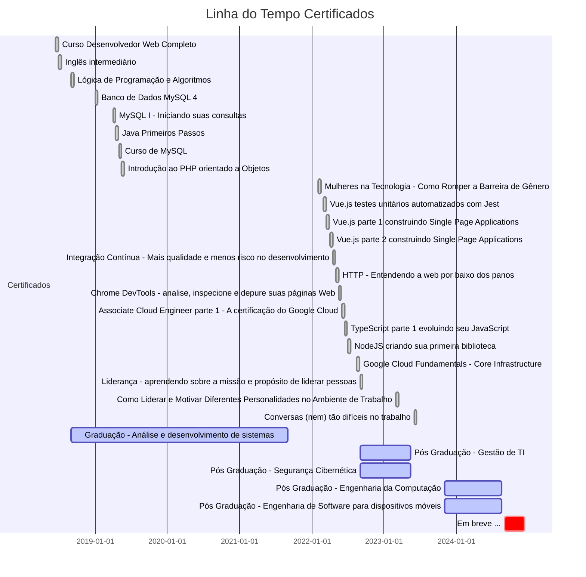

## Certificados que abrangem toda a minha trajetória, desde 2018 até o presente:
- [CURSO-DE-ALGORITMO.pdf](./CURSO-DE-ALGORITMO.pdf)
- [CERTIFICADO-MULHERES-NA-TECNOLOGIA.pdf](./CERTIFICADO-MULHERES-NA-TECNOLOGIA.pdf)
- [COMO-LIDERAR-E-MOTIVAR.pdf](./COMO-LIDERAR-E-MOTIVAR.pdf)
- [CONVERSAS-NEM-TAO-DIFICEIS-NO-TRABALHO.pdf](./CONVERSAS-NEM-TAO-DIFICEIS-NO-TRABALHO.pdf)
- [CURSO-DE-MYSQL.pdf](./CURSO-DE-MYSQL.pdf)
- [EVENTO-CODECON-2023.pdf](./EVENTO-CODECON-2023.pdf)
- [GOOGLE-CLOUD-FUNDAMENTALS.pdf](./GOOGLE-CLOUD-FUNDAMENTALS.pdf)
- [HTML-CSS-WEB.pdf](./HTML-CSS-WEB.pdf)
- [INGLÊS-INTERMEDIÁRIO.pdf](./INGLÊS-INTERMEDIÁRIO.pdf)
- [INTRODUÇÃO-PHP-OO.pdf](./INTRODUÇÃO-PHP-OO.pdf)
- [JAVA-PRIMEIROS-PASSOS.pdf](./JAVA-PRIMEIROS-PASSOS.pdf)
- [JEITO-LIDER-ATLAS-2023.pdf](./JEITO-LIDER-ATLAS-2023.pdf)
- [MYSQL-INICIANTE.pdf](./MYSQL-INICIANTE.pdf)
- [PALESTRANTE-TDC-2022.pdf](./PALESTRANTE-TDC-2022.pdf)
- [PÓS-GRADUAÇÃO-GESTÃO-DA-TI.pdf](./PÓS-GRADUAÇÃO-GESTÃO-DA-TI.pdf)
- [PÓS-GRADUAÇÃO-SEGURANÇA-E-DEFESA-CIBERNÉTICA.pdf](./PÓS-GRADUAÇÃO-SEGURANÇA-E-DEFESA-CIBERNÉTICA.pdf)
- [Curso Associate Cloud Engineer parte 1_ a certificação do Google Cloud](./GOOGLE-CLOUD-FUNDAMENTALS.pdf)
- [Curso Chrome DevTools_ analise, inspecione e depure suas páginas Web](./Curso%20Chrome%20DevTools_%20analise,%20inspecione%20e%20depure%20suas%20páginas%20Web%20-%20Alura.pdf)
- [Curso HTTP_ Entendendo a web por baixo dos panos](./Curso%20HTTP_%20Entendendo%20a%20web%20por%20baixo%20dos%20panos%20-%20Alura.pdf)
- [Curso Integração Contínua_ mais qualidade e menos risco no desenvolvimento](./Curso%20Integração%20Contínua_%20mais%20qualidade%20e%20menos%20risco%20no%20desenvolvimento%20-%20Alura.pdf)
- [Curso Liderança_ aprendendo sobre a missão e propósito de liderar pessoas ](./Curso%20Liderança_%20aprendendo%20sobre%20a%20missão%20e%20propósito%20de%20liderar%20pessoas%20-%20Alura.pdf)
- [Curso NodeJS_ criando sua biblioteca](./Curso%20NodeJS_%20criando%20sua%20biblioteca%20-%20Alura.pdf)
- [Curso TypeScript parte 1_ evoluindo seu JavaScript](./Curso%20TypeScript%20parte%201_%20evoluindo%20seu%20JavaScript%20-%20Alura.pdf)
- [Curso Vue.js parte 1_ construindo Single Page Applications](./Curso%20Vue.js%20parte%201_%20construindo%20Single%20Page%20Applications%20-%20Alura.pdf)
- [Curso Vue.js parte 2_ construindo Single Page Applications](./Curso%20Vue.js%20parte%202_%20construindo%20Single%20Page%20Applications%20-%20Alura.pdf)
- [Curso Vue.js_ testes unitários automatizados com Jest](./Curso%20Vue.js_%20testes%20unitários%20automatizados%20com%20Jest%20-%20Alura.pdf)

